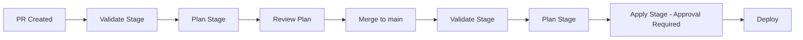

# Azure DevOps Pipelines for Hub-Spoke Terraform Infrastructure

This directory contains Azure DevOps (ADO) pipelines for deploying and managing hub-spoke infrastructure on Azure using Terraform with OIDC authentication, approval gates, and comprehensive validation.

## 📁 Directory Structure

```
.azdo/
├── pipelines/
│   ├── hub-deploy.yml           # Hub infrastructure deployment pipeline
│   ├── spoke-deploy.yml         # Spoke AKS infrastructure deployment pipeline
│   └── templates/
│       ├── terraform-init.yml   # Terraform initialization with Azure backend
│       ├── terraform-validate.yml  # Tier 1 & 2 validation checks
│       ├── terraform-plan.yml   # Plan generation with artifact storage
│       └── terraform-apply.yml  # Apply from saved plan artifact
└── README.md                    # This file
```

## 🚀 Pipeline Architecture

### Hub Deployment Pipeline (`hub-deploy.yml`)

Deploys hub infrastructure including:
- Virtual Network with hub subnets
- Azure Firewall for egress control
- Azure Bastion for secure access
- Private DNS zones
- Log Analytics workspace
- Application Gateway (optional)
- DNS Resolver (optional)

**Trigger paths:**
- `infra/terraform/hub-eastus/**`
- `.azdo/pipelines/hub-deploy.yml`
- `.azdo/pipelines/templates/**`

### Spoke Deployment Pipeline (`spoke-deploy.yml`)

Deploys spoke infrastructure including:
- Spoke Virtual Network with VNet peering to hub
- AKS cluster with Azure CNI, Cilium network policy
- Azure Container Registry
- Key Vault
- Private endpoints

**Dependencies:**
- Hub infrastructure MUST be deployed first
- Pipeline verifies hub remote state exists before deployment

**Trigger paths:**
- `infra/terraform/spoke-aks-prod/**`
- `.azdo/pipelines/spoke-deploy.yml`
- `.azdo/pipelines/templates/**`

## 🔧 Prerequisites

### 1. Service Connections (OIDC)

Create two Azure Resource Manager service connections with Workload Identity Federation:

| Name | Subscription | Purpose |
|------|--------------|---------|
| `azure-hub-prod` | `f8a5f387-2f0b-42f5-b71f-5ee02b8967cf` | Hub infrastructure deployment |
| `azure-spoke-prod` | `f8a5f387-2f0b-42f5-b71f-5ee02b8967cf` | Spoke infrastructure deployment |

**Required permissions:**
- **Contributor** role on subscription
- **Storage Blob Data Contributor** on state storage account `sttfstatedevd3120d7a`

### 2. Variable Groups

Create two variable groups in Azure DevOps:

#### `terraform-hub-prod`

| Variable | Value | Secret | Description |
|----------|-------|--------|-------------|
| `subscription_id` | `f8a5f387-2f0b-42f5-b71f-5ee02b8967cf` | No | Azure subscription ID |
| `admin_ssh_public_key` | `ssh-rsa AAAA...` | **Yes** | SSH public key for jump box |

#### `terraform-spoke-prod`

| Variable | Value | Secret | Description |
|----------|-------|--------|-------------|
| `subscription_id` | `f8a5f387-2f0b-42f5-b71f-5ee02b8967cf` | No | Azure subscription ID |
| `admin_ssh_public_key` | `ssh-rsa AAAA...` | **Yes** | SSH public key for jump box |

**Note:** Mark `admin_ssh_public_key` as **secret** type in ADO.

### 3. Environment with Approval Gates

Create a `prod` environment in Azure DevOps:

1. Go to **Pipelines** → **Environments**
2. Click **New environment**
3. Name: `prod`
4. Resource: **None**
5. Click **Create**

**Add approval gates:**
1. Open `prod` environment
2. Click **⋮** → **Approvals and checks**
3. Click **+** → **Approvals**
4. Add approvers
5. Enable **Requester cannot approve**
6. Set timeout: 30 days
7. Click **Create**

### 4. Backend Storage

Remote state is stored in Azure Storage:

| Property | Value |
|----------|-------|
| Subscription | `f8a5f387-2f0b-42f5-b71f-5ee02b8967cf` |
| Resource Group | `rg-terraform-state-dev` |
| Storage Account | `sttfstatedevd3120d7a` |
| Container (Prod) | `terraform-state-prod` |
| Hub State Key | `hub-eastus/terraform.tfstate` |
| Spoke State Key | `spoke-aks-prod/terraform.tfstate` |
| Auth Method | OIDC (`use_oidc = true`) |

## 🔄 Pipeline Workflow

### Normal Deployment Flow



### Stages

#### 1. **Validate Stage**
- Runs on: PR and main branch
- Tier 1 & 2 checks:
  - `terraform fmt -check -recursive`
  - `terraform validate`
  - `tfsec` security scan (if available)
- Duration: ~1-2 minutes

#### 2. **Plan Stage**
- Runs on: PR and main branch after validation
- Generates Terraform plan with `-out=tfplan`
- Saves plan as pipeline artifact
- Displays human-readable plan output
- Duration: ~2-3 minutes

#### 3. **Apply Stage** (main branch only)
- Requires: Manual approval from `prod` environment
- Downloads saved plan artifact
- Applies exact plan that was reviewed
- Only runs on `main` branch (not PRs)
- Duration: ~10-20 minutes for hub, ~15-30 minutes for spoke

#### 4. **Destroy Stage** (manual trigger only)
- Requires:
  - Runtime parameter: `action` = `destroy`
  - Manual pipeline run
  - Approval from `prod` environment
- Destroys all infrastructure
- Duration: ~10-15 minutes

### Hub Dependency for Spoke

The spoke pipeline includes a **Hub Dependency Check** stage that:
1. Verifies hub state file exists in remote backend
2. Prevents spoke deployment if hub is not deployed
3. Fails fast before running plan/apply stages

## 📋 Operational Runbook

### Deploying Hub Infrastructure

1. **Create/update Terraform code** in `infra/terraform/hub-eastus/`
2. **Create PR** to `main` branch
3. **Pipeline automatically runs:**
   - Validate stage
   - Plan stage (review plan output)
4. **Review and merge PR**
5. **Pipeline runs on main:**
   - Validate stage
   - Plan stage
   - Apply stage pauses for approval
6. **Approve deployment** in ADO Environments
7. **Apply stage completes** deployment

### Deploying Spoke Infrastructure

**Prerequisites:** Hub infrastructure must be deployed first

1. **Create/update Terraform code** in `infra/terraform/spoke-aks-prod/`
2. **Create PR** to `main` branch
3. **Pipeline automatically runs:**
   - Validate stage
   - Hub dependency check (verifies hub exists)
   - Plan stage (review plan output)
4. **Review and merge PR**
5. **Pipeline runs on main:**
   - Validate stage
   - Hub dependency check
   - Plan stage
   - Apply stage pauses for approval
6. **Approve deployment** in ADO Environments
7. **Apply stage completes** deployment

### Destroying Infrastructure

**⚠️ WARNING: This is destructive and irreversible!**

**Destroy spoke first, then hub** (reverse order of deployment):

1. **Go to Pipelines** → Select `spoke-deploy.yml`
2. **Click "Run pipeline"**
3. **Select runtime parameter:**
   - **Pipeline Action:** `destroy`
4. **Click "Run"**
5. **Approve destruction** when prompted
6. **Wait for spoke destruction to complete**
7. **Repeat steps 1-6 for `hub-deploy.yml`**

### Reviewing Plan Artifacts

Plan artifacts are saved for audit and review:

1. **Navigate to pipeline run**
2. **Click "1 published" artifacts**
3. **Download** `hub-tfplan` or `spoke-tfplan`
4. **View locally:**
   ```bash
   terraform show tfplan
   ```

## 🔍 Validation Tiers

### Tier 1: Pre-Commit (Manual - Not in Pipeline)
Developers run locally before committing:
```bash
terraform fmt -recursive
terraform validate
```

### Tier 2: Pre-PR (Validate Stage)
Automated in pipeline Validate stage:
```bash
terraform fmt -check -recursive
terraform validate
tfsec . --minimum-severity MEDIUM
```

### Tier 3: CI/CD (Apply Stage)
Full deployment with plan/apply:
- Terraform plan with detailed output
- Plan artifact storage for audit
- Apply with approval gates

## 🛠️ Troubleshooting

### Issue: "Hub state file not found"

**Symptom:** Spoke pipeline fails at Hub Dependency Check stage

**Solution:**
```bash
# Verify hub is deployed
az storage blob exists \
  --account-name sttfstatedevd3120d7a \
  --container-name terraform-state-prod \
  --name hub-eastus/terraform.tfstate \
  --auth-mode login
```

Deploy hub infrastructure first using `hub-deploy.yml` pipeline.

### Issue: "Terraform init failed"

**Symptom:** Init stage fails with authentication error

**Solution:**
1. Verify service connection has correct permissions:
   - Contributor on subscription
   - Storage Blob Data Contributor on `sttfstatedevd3120d7a`
2. Check OIDC configuration in service connection
3. Verify subscription ID matches: `f8a5f387-2f0b-42f5-b71f-5ee02b8967cf`

### Issue: "Plan shows unexpected changes"

**Symptom:** Plan detects changes not in your PR

**Solution:**
1. Check if someone else deployed manually
2. Review remote state in Azure Storage
3. Run plan locally to compare:
   ```bash
   cd infra/terraform/hub-eastus/
   terraform init -backend-config=backend-prod.tfbackend
   terraform plan -var-file=prod.tfvars
   ```

### Issue: "Variable not found"

**Symptom:** Pipeline fails with missing variable error

**Solution:**
1. Verify variable groups exist: `terraform-hub-prod`, `terraform-spoke-prod`
2. Check variable names match exactly (case-sensitive)
3. Ensure variable groups are linked in pipeline YAML
4. Verify `subscription_id` and `admin_ssh_public_key` are set

### Issue: "Apply stage not running"

**Symptom:** Pipeline stops after Plan stage

**Solution:**
- Apply only runs on `main` branch (not PRs)
- Check if pipeline was triggered by PR
- Merge PR to `main` to trigger apply stage
- Verify condition in pipeline: `eq(variables['Build.SourceBranch'], 'refs/heads/main')`

## 🔐 Security Best Practices

### What NOT to Commit

❌ Never commit:
- `.tfstate` or `.tfstate.backup` files
- `terraform.tfvars` with real values
- SSH private keys
- Azure credentials
- Service principal secrets

### State Management

✅ Remote state:
- Stored in Azure Storage
- State locking enabled
- Separate containers per environment
- OIDC authentication (no secrets)

### Access Control

✅ Least privilege:
- Service connections have minimal required permissions
- Approval gates required for production deployments
- Separate approvers for apply and destroy
- Audit trail via pipeline logs

## 📊 Pipeline Metrics

### Expected Duration

| Stage | Hub | Spoke |
|-------|-----|-------|
| Validate | ~1-2 min | ~1-2 min |
| Hub Check | N/A | ~30 sec |
| Plan | ~2-3 min | ~2-3 min |
| Apply | ~10-20 min | ~15-30 min |
| Destroy | ~10-15 min | ~10-15 min |

### Resource Counts (Approximate)

| Infrastructure | Resources Created |
|----------------|-------------------|
| Hub | ~50-70 resources |
| Spoke | ~40-60 resources |

## 📚 Additional Resources

- [Terraform Azure Backend](https://developer.hashicorp.com/terraform/language/settings/backends/azurerm)
- [Azure DevOps OIDC with Azure](https://learn.microsoft.com/en-us/azure/devops/pipelines/library/connect-to-azure)
- [Hub-Spoke Network Topology](https://learn.microsoft.com/en-us/azure/architecture/reference-architectures/hybrid-networking/hub-spoke)
- [AKS Baseline Architecture](https://learn.microsoft.com/en-us/azure/architecture/reference-architectures/containers/aks/baseline-aks)

## 🤝 Support

For issues or questions:
1. Check troubleshooting section above
2. Review pipeline logs in Azure DevOps
3. Check Terraform documentation
4. Review [GitHub issues](https://github.com/ckellywilson/eco-aks-adr/issues)

---

**Last Updated:** February 2026  
**Maintained By:** Infrastructure Team
