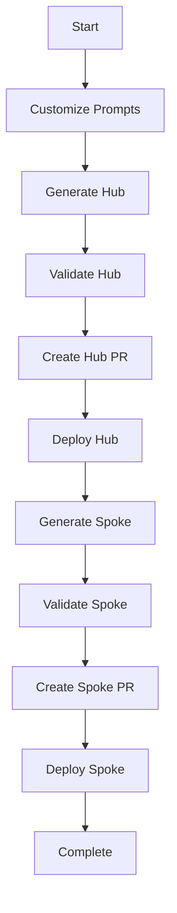

# GitHub Agent Skills for Azure Infrastructure

This directory contains **GitHub Copilot Agent Skills** that automate Terraform infrastructure-as-code generation from flexible JSON configuration.

## 📚 What Are Agent Skills?

Agent Skills are folders of instructions that GitHub Copilot automatically loads when relevant to your task. Each skill is stored in its own directory with a `SKILL.md` file containing:
- **YAML frontmatter** with name, description, and license
- **Detailed instructions** on how to perform the task
- **References** to prompts, instructions, and documentation

For more information, see [GitHub's Agent Skills documentation](https://docs.github.com/en/copilot/concepts/agents/about-agent-skills).

## 🏗️ Architecture Overview

```
┌─────────────────────────────────────────────────────────┐
│  Flexible JSON Configuration (Engineer-provided)        │
│  - metadata, globalConstraints, topology, aksDesign     │
│  - Multiple hubs and spokes with resource definitions   │
└─────────────────────────────────────────────────────────┘
                           ↓
                           │ Read by
                           │
┌─────────────────────────────────────────────────────────┐
│  .claude/skills/terraform/generate-from-json/           │
│  Terraform Generator (Multi-hub/multi-spoke)            │
│  ← YOU ARE HERE                                         │
└─────────────────────────────────────────────────────────┘
                           ↓
                           │ References
                           ↓
┌─────────────────────────────────────────────────────────┐
│  .github/prompts/terraform/infrastructure.prompt.md     │
│  Code Patterns & Templates (AVM module blocks)          │
└─────────────────────────────────────────────────────────┘
                           +
┌─────────────────────────────────────────────────────────┐
│  .github/instructions/                                  │
│  - terraform-flexible-json-mapping.instructions.md      │
│  - azure-verified-modules-terraform.instructions.md     │
│  - generate-modern-terraform-code-for-azure.instructions.md │
└─────────────────────────────────────────────────────────┘
                           ↓
                           │ Generates
                           ↓
┌─────────────────────────────────────────────────────────┐
│  infra/terraform/                                       │
│  ├── hub-{name}/          (for each hub)                │
│  └── spoke-{name}/        (for each spoke)              │
└─────────────────────────────────────────────────────────┘
```

## 🎯 Available Skills

### 1. **terraform/generate-from-json**
**Purpose**: Generate Terraform infrastructure from flexible JSON schema  
**Trigger**: "Generate Terraform from my JSON"

**What it does:**
- Reads flexible JSON configuration with metadata, globalConstraints, topology (hubs[], spokes[]), aksDesign
- Creates segregated folders: `hub-{hubName}/` and `spoke-{spokeName}/`
- Generates provider aliases for multi-subscription deployments
- Applies Azure Verified Modules (AVM) for all resources
- Creates hub outputs in `{hub-name}-outputs.json`
- Spokes consume hub outputs via `jsondecode(file(...))`
- Supports default resources per spoke type: aks, data, integration, sharedServices, other
- Validates JSON schema and prompts for missing resources

**When to use**: When you have a completed flexible JSON configuration

**Example:**
```
You: "Generate Terraform from this JSON"
     ↓
Copilot reads: your-config.json
Copilot applies: terraform-flexible-json-mapping.instructions.md
Copilot uses patterns: terraform/infrastructure.prompt.md
     ↓
Generates:
  infra/terraform/hub-eastus/
  infra/terraform/hub-westus/
  infra/terraform/spoke-aks-prod/
  infra/terraform/spoke-data-shared/
```

---

### 2. **validate-terraform**
**Purpose**: Comprehensive Terraform validation  
**Trigger**: "Validate my Terraform code", "Run validation checks"

**What it does:**
- Runs `terraform fmt` - Format checking
- Runs `terraform validate` - Syntax validation
- Checks AVM module compliance (sources, versions, telemetry)
- Verifies variable descriptions and output documentation
- Security scans with `tfsec` (recommended)
- Optional: `checkov` for additional policy checks

**When to use**: After code generation, before commits, before PRs

---

## 🚀 Quick Start

### Workflow

1. **Create flexible JSON configuration**:
   - Define metadata (customer, environment, workshop info)
   - Set globalConstraints (regions, subscriptions, naming, tags, compliance)
   - Define topology.hubs[] (one or more hubs)
   - Define topology.spokes[] (one or more spokes with type and resources)
   - Define aksDesign.clusters[] (AKS cluster configurations)

2. **Generate infrastructure**:
   ```
   "Generate Terraform from this JSON"
   ```

3. **Validate the code**:
   ```
   "Validate my Terraform code"
   ```

4. **Deploy** (manual):
   ```bash
   cd infra/terraform/hub-eastus && ./deploy.sh dev
   cd infra/terraform/spoke-aks-prod && ./deploy.sh dev
   ```

## 💡 How Skills Work

### Automatic Activation

Skills are **automatically loaded** by Copilot agent mode when your prompt is relevant:

```
You: "Generate hub infrastructure"
     ↓
Copilot detects: generate-hub-infrastructure skill
     ↓
Copilot reads: .github/prompts/hub-landing-zone.prompt.md
Copilot applies: .github/instructions/*.instructions.md
     ↓
Copilot generates: hub/ directory with compliant Terraform code
     ↓
Copilot validates: Runs all required checks
     ↓
Output: Production-ready infrastructure code
```

### Context Awareness

Skills automatically:
- Read your customized prompts
- Apply repository standards from instructions
- Reference examples and documentation
- Validate against AVM requirements
- Follow repository workflow from `.github/copilot-instructions.md`

## 📖 Typical Workflow

### Complete Landing Zone Deployment



### Commands at Each Stage

```bash
# Stage 1: Planning
"Help me customize the prompts"  # customize-aks-prompts skill

# Stage 2: Hub Infrastructure
"Generate hub infrastructure"     # generate-hub-infrastructure skill
"Validate my Terraform code"      # validate-terraform skill
"Create infrastructure PR"        # create-infrastructure-pr skill

# Stage 3: Deploy Hub (manual)
cd hub && terraform init && terraform apply

# Stage 4: Spoke Infrastructure
"Generate AKS spoke infrastructure"  # generate-aks-spoke skill
"Validate my Terraform code"         # validate-terraform skill
"Create infrastructure PR"           # create-infrastructure-pr skill

# Stage 5: Deploy Spoke (manual)
cd spoke-aks && terraform init && terraform apply
```

## 🎨 Customization

### Inheriting Skills (Template Users)

When you use this template repository:
- ✅ **Skills are inherited** - They work immediately
- ✅ **Prompts are customized** - You edit `.github/prompts/` for your needs
- ✅ **Instructions are inherited** - Standards apply automatically

You typically **do not modify** skills unless you're:
- Adding new infrastructure types
- Changing organizational workflow
- Extending validation requirements

### Modifying Skills (Advanced)

To modify a skill:
1. Edit `SKILL.md` in the skill directory
2. Test with Copilot agent mode
3. Commit changes

Structure of `SKILL.md`:
```markdown
# Skill Name

## Purpose
What the skill does

## When to Use This Skill
Trigger phrases

## Task
High-level objective

## Prerequisites
What must exist before running

## Instructions
Step-by-step execution logic

## Success Criteria
What "done" looks like

## Common Issues and Solutions
Troubleshooting guide

## Resources Referenced
Files the skill reads
```

## 🔍 Troubleshooting

### Skill Not Triggering

**Issue**: Copilot doesn't activate the skill  
**Solution**: Use more explicit trigger phrases from skill documentation

```
❌ "Make infrastructure"
✅ "Generate hub infrastructure"

❌ "Check my code"
✅ "Validate my Terraform code"
```

### Skill Execution Errors

**Issue**: Skill fails during execution  
**Solution**: Check prerequisites

```bash
# For generate-* skills: Ensure prompts are customized
cat .github/prompts/spoke-aks.prompt.md | grep "DECISION REQUIRED"
# Should return empty if complete

# For validate-* skills: Ensure terraform is available
terraform version

# For create-pr skill: Ensure you're on feature branch
git branch --show-current
```

### Configuration Issues

**Issue**: Generated code doesn't match expectations  
**Solution**: Verify prompt customizations

1. Check `.github/docs/aks-configuration-decisions.md` is complete
2. Verify `.github/prompts/spoke-aks.prompt.md` has no `[DECISION REQUIRED]` placeholders
3. Run customize-aks-prompts skill again if needed

### Validation Failures

**Issue**: Terraform validation fails  
**Solution**: 
- Ensure you're in a directory containing `.tf` files
- Run validation from Terraform working directories (e.g., `hub-*/`, `spoke-*/`)
- Check error messages for specific issues to fix
- Re-run validation after fixing issues

**Issue**: tfsec not found  
**Solution**: 
- tfsec is recommended but optional
- Install: https://github.com/aquasecurity/tfsec
- Validation will continue without it

## 📚 Learning Resources

### Understanding Skills
- [GitHub Agent Skills Documentation](https://docs.github.com/copilot/concepts/agents/about-agent-skills)
- [Anthropic Claude Skills](https://github.com/anthropics/skills) - Example skills repository

### Azure & AKS
- `.github/docs/aks-configuration-decisions.md` - Decision guide
- `.github/docs/deployment-scenarios.md` - Deployment patterns
- `.github/instructions/azure-verified-modules-terraform.instructions.md` - AVM standards

### Terraform
- `.github/instructions/terraform-azure.instructions.md` - Best practices
- `.github/examples/*.tfvars` - Reference configurations

## 🤝 Contributing

### Adding New Skills

To add a skill for a new infrastructure component:

1. **Create skill directory**:
   ```bash
   mkdir .claude/skills/generate-[component]
   ```

2. **Create SKILL.md**:
   ```bash
   cp .claude/skills/generate-hub-infrastructure/SKILL.md \
      .claude/skills/generate-[component]/SKILL.md
   ```

3. **Customize the skill**:
   - Update purpose, triggers, task
   - Modify instructions for your component
   - Reference appropriate prompts and instructions

4. **Test the skill**:
   ```
   "Generate [component]"
   ```

5. **Update this README**:
   - Add skill to "Available Skills" section
   - Update workflow if needed

### Improving Existing Skills

1. Test skill with various scenarios
2. Identify gaps or improvements
3. Update `SKILL.md`
4. Test changes
5. Submit PR with clear description

## 📝 Skill Development Guidelines

When creating or modifying skills:

### Do's ✅
- Reference repository prompts and instructions
- Provide clear trigger phrases
- Include detailed step-by-step instructions
- Define success criteria
- Add troubleshooting guidance
- Validate against standards
- Explain WHY, not just WHAT

### Don'ts ❌
- Don't hardcode values that should come from prompts
- Don't skip validation steps
- Don't assume prerequisites without checking
- Don't generate code without reading prompts
- Don't ignore repository instructions

## 🔐 Security Considerations

Skills have access to:
- ✅ Repository files (prompts, instructions, docs)
- ✅ Git history and branches
- ✅ Terraform configuration files

Skills do NOT have access to:
- ❌ Azure credentials
- ❌ Terraform state files (read-only only)
- ❌ Secrets or sensitive values

**Best Practices**:
- Skills should never generate hardcoded credentials
- Always reference instructions for security standards
- Include security validation in skill execution
- Follow principle of least privilege

## 📊 Skill Metrics

Track skill usage and effectiveness:

### Successful Execution
- Infrastructure generated without errors
- Validation passes on first run
- PRs created with complete information

### Areas for Improvement
- Skills requiring multiple iterations
- Common user questions after skill execution
- Validation failures after code generation

## 🆘 Support

### Issues with Skills
Create an issue with:
- Skill name
- Trigger phrase used
- Expected behavior
- Actual behavior
- Error messages (if any)

### Feature Requests
Suggest new skills or improvements:
- Use case description
- Desired behavior
- Current workaround (if any)

### Questions
Ask in issues or discussions:
- "How do I use [skill] for [scenario]?"
- "What's the difference between [skill A] and [skill B]?"
- "Can skills do [specific task]?"

---

## 🎉 Summary

GitHub Agent Skills in this repository provide:
- **Automation**: Generate infrastructure code from specifications
- **Validation**: Ensure code quality and compliance
- **Workflow**: Guide through development process
- **Consistency**: Apply standards automatically
- **Education**: Help users understand configuration options

**Start with**: `"Help me customize the prompts"`

**Generate infrastructure**: `"Generate [hub|spoke] infrastructure"`

**Validate code**: `"Validate my Terraform code"`

**Create PR**: `"Create infrastructure PR"`

Skills make infrastructure-as-code development faster, more consistent, and less error-prone! 🚀
